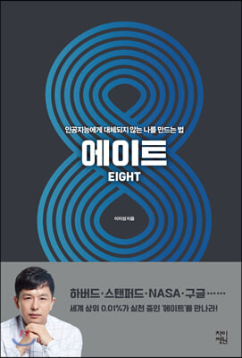

{: width="300"}
#### 지은이 : 이지성
#### 읽은 기간 : 3/2(월) ~ 3/5(목) 4일

## 느낀점

이 책은 내 대학교 선배 영찬이형이 선물해 준 책이다. 내 행복과 성공을 진심으로 기원해주는 영찬이형이 준 책이라 정말 열심히 여러번 읽어야 겠다는 생각을 했었다.

이 책을 선물받은 건 약 2달전이다. 책을 받자마자 읽으려 했지만 길게 읽지 못했었다. 아이러니하게도 책이 너무 좋아서였다. 조금밖에 읽지 않았지만 나를 자극하는 문장들이 많았다. 조금 웃기지만 공부가 하고 싶어졌었다. 그렇게 조금 읽다 공부를하고 를 반복하다보니 많이 읽지 못한채로 방치해두고 있었는데 동아리방에 또 다른 이 책이 놓여져 있었다. 커니사 회원들과 10시까지 학교에 도착해서 하루에 2시간 정도 책을 읽었었다. 내가 궁금하고 논의할 이야기가 있으면 5명 다같이 토의(?)하곤 했다.

가장 많이 들었던 생각은 두려움이였다. 인공지능은 생각보다 빠른 속도로 성장하고 있고 그 성장이 멈추지 않고 있다. 내가 밥을 먹고 음악을 듣고 이야기를 나누고 있는 "지금"도 인공지능은 학습을 하고 있다. 그런 인공지능에게 내가 대체가 될 수도 있지 않을까?
