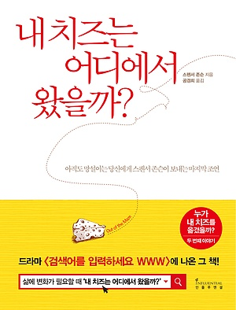

{: width="300"}
#### 지은이 : 스펜서 존슨
#### 읽은 기간 : 3/6(금) 1일
## 읽기 전
 이 책의 장르가 어떤 것 일지 찾아보고 "사실 이런 책을 좋아하진 않는다" 라고 쓰고 시작하려 했는데 'yes24'에 분류된 바로는 자기계발서이다. 누가 옆에서 읽길래 자연스럽게 흥미가 생겼을뿐이고 읽기 시작하려 한다. 그리고 부제가 '아직도 망설이는 당신에게' 이다. 나는 아직도 여러가지 문제로 망설이고 있다. 사람은 누구나 고민거리를 가지고 있다고 생각한다. 누구든 조언해 줄수 있지만 답은 누구도 해줄 수 없는 그런 문제를. 그렇기에 더 어렵고 고민하는 것을 꺼리게 되었다. 이 책이 이런 나에게 조금 도움이 될 거 같다.

## Notes
>  **그저 내려놓고 시도해보면 어렵지 않아** (page 65)   

 헴은 항상 치즈만 먹고 자랐었다. 또 치즈를 찾아 평생을 살아왔다. 우리가 봤을때 웃긴 일일 수 있지만 내가 만약 헴이고 평생을 그렇게 살았다면 사과를 먹는 행위, 치즈를 더이상 찾지 않는 행위는 정말 위험한 행동일 수 있다.
 어떤 중요한 고민, 나아가 누군가의 삶 조차도 당사자에겐 엄청나 보여도 또 다른 그릇을 가지고 있는 사람에게는 별일이 아닐 수 있다. 또 그길이 당사자가 나아가야 하는 길 일 수도 있다.

> 생각을 말로 하는 것은 더 확실히 정리하는 데 도움이 되었다. (Page 77)   

 뭔가 문구가 귀여웠다. 소설을 읽는 것처럼 편하게 읽고 있었는데 저자의 생각을 독자들을 위해 나지막히 전달하는게 좋았다. 

> 신념은 내가 사실이라고 믿는 생각이다 (Page 79)   

신념이라하면 뭔가.. 바뀌면 안될 불변의 어떤것이라는 생각이 있다. 근데 '허'가 정의하길 '신념은 내가 사실이라고 믿는 생각이다' 라고 한다. 여기서 신념이라는 정의를 구성하는 3가지 단어 '사실', '믿는다', '생각'  모두 추상적이라는 생각이 든다. 언제든 변할 수 있다. 신념을 갖고 삶을 신념에 따라 추구하되 신념이 언제든 바뀌어도 된다는 것이다.

> 어떤 신념은 우리를 주저앉히고, 어떤 신념은 우리를 나아가게 한다 (Page 83)  

 앞서 말했듯이 신념은 '내가 사실이라고 믿는 생각이다' 이라고 정의되어 있다. 신념의 옳고 그름은 없다. 우리를 주저 앉히는 신념과 나아가게 하는 신념이 있을 뿐이다. 아마 모든 사람이 원할것이다. 나아가는 신념을 갖기를 이는 곧 내 생각이 건강해야 함을 의미한다. 생각을 성형한다고 어디서 봤던 것 같다. 이렇게 책을 읽고 생각하는 과정이 내 생각의 성형하고 나아가게하는 신념을 찾는 방법이다.

> 이건 불가능한 탐험이었다. 그러니 시도해본들 아무 소용 없었다. 그런데 --- 
'불가능한' 부분이 또 다른 신념이라면? 그는 이것을 바꿀 수 있을까? (Page 90)  

 '불가능'이라는 말을 싫어하며 살고 있다고 생각한다. 이 신념은 나에게 도움이 된다. 그런데 무의식적으로 '이것은 불가능'하다고 느끼는 것 같다. 헴은 이제야 깨달았지만 용기를 냈다. 자신이 살아온 평생을 바꾸겠다고 다짐하는 말이다. 나도 좀 더 용기를 가져보자. 생각해보자.

> 우리가 믿을 수 있는 것에 한계는 없다 (Page 93)  

 믿는다는 것은 '생각'의 연장선이다. 나는 무엇이든 생각할 수 있고 믿을 수 있다. 남들이 그것을 믿든 말든 그것은 나에게 중요하지 않다. 남의 시선은 중요하지 않다. 중요한 것은 내가 믿을 수 있느냐 없느냐이다. 

미로에서 나오는 방법

	1. 신념에 주목하라.
	-> 신념은 우리가 사실이라고 믿는 생각이다.

	2. 생각하는 모든 것을 믿지 마라.
	-> 때로 '사실'은 그저 상황을 인식하는 방법일 뿐이다.

	3. 효과가 없는 것은 내려놔라.
	-> 낡은 짐을 들고는 새로운 탐험을 시작할 수 없다.

	4. 미로 밖을 보라
	-> 있을 수 없는 것을 상상하고 불가능한 것을 탐색하라.

	5. 새로운 신념을 선택하라.
	-> 생각을 바꿔도 나의 본모습은 바뀌지 않는다.

	6. 우리가 믿을 수 있는 것에 한계는 없다.
	-> 할 수 있다고 생각한 것보다 더 많이 실행하고 경험하고 즐길 수 있다.

### 이 책에서 미로가 상징하는 것
* 치즈를 찾는데 어려움을 주는 요소
* 과거의 경험
* 신념을 바꾸는데 방해가 되는 것
* 세상

