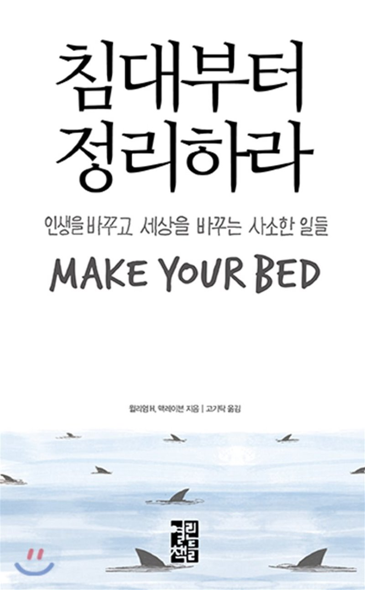

{: width="300"}
#### 지은이 : 윌리엄 H. 맥레이븐
#### 읽은 기간 : 3/7(토) ~ 3/9(월) 3일

> 세상을 바꾸고 싶다면 실패를 두려워하지 말라  

 실패라는게 어떤걸까? 실패가 있으려면 시도가 있어야 한다. 무언가를 시도해본 게 너무 오래전 일이라 잘 기억이 나지 않는 것일지도 모른다. 혹은 내가 너무 무뎌졌을지도 모른다. 매일 아침에 일찍 일어나려는 시도, 매일 할일을 적고 꼭 다 해야지 다짐하는 행위또한 시도로 본다면 나는 실패에 무뎌졌다. 
 삶의 작은 부분에서도 의미를 주고 실패에 대해 생각해보고 계기로 조금씩 더 성장하자.

> 하나의 임무를 완수하는 것으로 하루를 시작하라. 살아가는 동안 당신을 도와줄 누군가를 찾아라. 모든 사람을 존중하라. 인생이란 공평하지 않을뿐더러 당신이 자주 실패할 거라는 사실을 인정하라.  

 내가 좋아하는 말이다. 나는 자주 실패한다. 정말 부끄럽지만 매일 실패한다.. 그리고 또 도전한다. 나는 오늘도 도전했고, 성공할 것이라 생각한다. 하지만 실패할 수도 있다. 또 하지만 내일 또 도전할 것이다. 그렇게 언젠가 성공할 것이라고 나는 믿고있다.

## 느낀점
 요즘 읽은 다른 책들과 다르게 이 책을 접한건 단순히 '밀리의 서재'에 있기 떄문이었다. 책의 내용이 저자가 군인 생활을 하며 있었던 경험을 이야기하며 부가적으로 설명을 덧붙이며 책을 써 내려갔으므로 부담없이 쉽게 읽을 수 있었다.
 한가지 아쉬운점은 중후반부터 독서를 기록하기 시작했다는 점이다. 그래서 기록한 내용이 많지 않다.