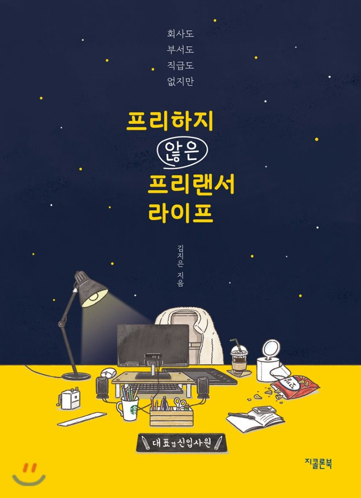

{: width="300"}
#### 지은이 : 김지은
#### 읽은 기간 : 3/10(화) ~ 3/17(화) 8일
## 읽기 전
 여유가 조금도 없던 나에게 부모님으로 부터 용돈이 들어와 '이번엔 어떻게 사용해야 할까?' 고민을 하다가 학교를 오던길에 북카페에 들렀다. 책을 둘러보다보니 역시 사고싶은 책이 너무 많았다. 나는 지금 25살 이제 대학교 4학년이 되었다. 당연히 앞으로에 대해 고민이 많을 시기이다. 다른 곳에서 이야기하겠지만 회사를 다닐 생각하면 가슴이 답답하다. 그런 나에게 또다른 선택지가 있었지만 떄론 까먹고 있었다. 바로 '프리랜서' 라는 직업이다. 이 책을 부제목으로 "일흔 살에도 좋아하는 일을 하고 싶어서 프리랜서 라이프를 선택했습니다" 라는 말이 나에게 너무 공감되었다. 좋아하는 것과 잘하는 것 사이에서 고민하는 청년들에게 아이유가 말했다. '잘하는 것을 선택하되 좋아하는 것을 잊지 말아라' 이와는 조금 반대로 이 책의 저자는 좋아하는 것을 선택했다.  어떤 삶을 살고 있는지 궁금해 책을 구매했다. 
 
## Notes
책을 다 읽었다...

적을만한 내용이 딱히 생각나지 않아서 적진 않고 그냥 힐링하며 읽었다.

하지만 마지막 문장 하나만큼은 적고 넘어가고 싶다

> 이 모든 시간이 언젠가 내가 꿈꾸던 모습의 나를 위한 과정일 거라 위로하며 새까만 하늘에서 반짝이는 별을 보며 말해본다 "수고했어. 오늘도"  
 
