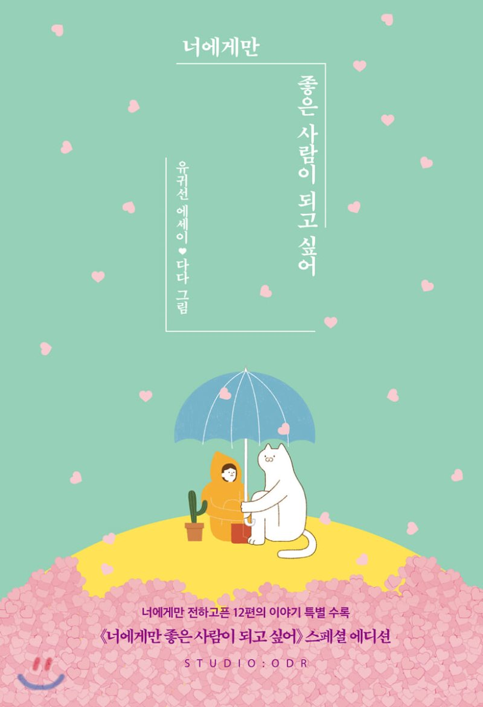

{: width="300"}
#### 지은이 : 유귀선
#### 읽은 기간 : 4/25

---

## 1. 기뻐서 잠 못 드는 날도 내게 있었지

> 오늘처럼 갑자기 비가 쏟아지는 날이면 당신과 함께하고 싶다. 당신과 빗소리를 듣고 싶다.

비가 갑자기 오면 그날 내 기분이 어떻든 상관없이 바뀐다. 그런데 어떻게 바뀌는지에 대해선 잘 모르겠다. 비에대해 생각해 보면 기분이 좋다가도 울적하다. 기분이 좋으면 좋아서 그 사람이 보고싶고 울적하면 울적해서 그 사람이 보고싶을 수 있다. 행복한 일이다. 그런사람이 옆에 없어서 아쉽다..ㅎ

---

> 오늘은 유난히 햇볕이 좋다는 핑계로 너와 거닐고 싶고, 하늘이 조금이라도 흐린 날엔 곧 비가 쏟아질지도 모르겠다며 괜히 우산을 챙겨 널 데리러 가고 싶어

 날이 좋다는 핑계로 당신이 보고싶다는 말은 너무 잔인할 정도로 스윗하다. 그런 생각이 드는사람과 함께 할 수 있다면 좋겠다. 이 책에서 혹시 답을..

---

> 너도 나에게만 예쁜 사람이 되어주었으면 싶어, 너도 내 생각에 살고, 기쁠 때도 슬플 때도 가장 먼저 나를 떠올려주면 좋겠어. 있지 아무래도 널 좋아하게 된 거 같아

 사랑이라는 소설은 한방향으로만 가면 처참한 비극이고 쌍방향이 되면 극적인 희극이다. 내가 좋아하는 건 쉽지만 상대가 나를 좋아하게 만드는 건 어렵다. 혹여나 사랑이라는 소설이 비극이더라도 사랑한다는 감정은 너무나도 소중하고 아름답다.

---

> 그 사람이 나에게 관심이 없는데도 포기가 안돼 혼자 끙끙 앓을 때가 있었지. 짝사랑은 잔인해, 그 말부터가 이건 사랑이 아니라고 말하는 것 같기도 해. 그토록 보고 싶고 생각이 나는데도 할 수 있는 게 아무것도 없지.

 너무 슬픈말이다. '할 수 있는 게 아무것도 없지'.. 보고싶어도, 듣고싶어도, 만지고싶어도, 볼수도, 들을수도, 만질수도 없는 그런게 짝사랑이다. 너무도 가슴이 아파서 아름답다고 할 수 있는지에 대해선 조금 더 생각해봐야 할듯하다.

---

> 그 사람의 모든 행동에 괜한 의미 부여를 하고, 혼자 상상하고 걱정하고 초조해할 뿐, 시간이 흘러도 변하지 않을 것을 알면서도 아주 작은 희망에 매달려 마음을 끊어내지 못해

 정말 신기하다. 사랑을 시작하고부턴 그 사람의 사소한 말, 말투, 표정, 생김새, 손짓 하나하나가 너무도 크게 느껴진다. 사소한 것들에 속아 혼자 헤어졌다 사귀기를 반복하는 그런 연애, 돈도 안들고 새로워서 가성비가 좋다고 누가 그랬는데, 공감하기 싫지만 공감해볼까.. 

---

### 연인이라는 건

> 거창하고 특별한 걸 해야 연인인 건 아니야. 오히려 그 반대가 아닐까. 오늘 서로에게 어떤 일이 있었는지 묻고 대답하며 시시콜콜한 이야기를 나누는 것. 내가 좋아하는 게임을 한번 같이 해보자고 졸라대고 내가 좋아하는 책을 같이 읽어보는 것, 각자가 좋아하는 노래를 들려주고 왜 좋아하는지 말해주는 것. 이런 소소한 것들을 아무 의식하지 않고 나누는 사이가 연인이겠지. 그 소중함을 아는 사람들이 연인이겠지.

 가슴이 너무 빨리 뛴다. 너무 설레는 말이다. 

---

> 너의 친절한 모습에 네가 좋아졌는데, 나한테만 친절한 게 아니라는 걸 알았어. 만나면 친절하게 대해주는 네 모습에 마음이 붕 떴다가도 다른 사람에게도 친절한 걸 아니까 또 혼자 속앓이를 해. 마음 줄 것도 아니면서 왜 그렇게 여지를 남기는 건지. 아, 여지를 주는 게 아니라 너는 그냥 모두에게 잘해주는 사람이지.

 그런 네가 너무 밉다. 그렇다고 정말 너를 미워할 수 없는 나도 밉다.

---

> 자기가 애교가 없다고 생각하는데 문득문득 못 견디게 귀여워

 가끔 옆에 있는 누군가가 미친듯이 귀여워서 말하고 싶읖때가 있다. 그럴 땐 내 말을 꾹꾹 눌러담아 귀엽다는 말 대신 장난을 치거나 핀잔을 준다. 어휴.

---

> 여름에는 너무 붙어 있으면 더우니까 서로의 새끼손가락만 잡고 걸을 거야. 다른 손엔 차가운 커피를 들고서. 해가 지고 저녁이 되면 한강으로 가서 시원한 강바람을 맞아야지. 그땐 네 손을 꼭 잡고 걸을 거야

  이 책을 저자에게 빠져들 것만 같다. 후

---

> 상대방이 나를 더 좋아하게 만들 수 없을까? 하는 생각이 든다는 건, 아마 너의 마음이 상대방의 마음보다 크다는 걸 느끼고 있다는 거겠지. 그런데 사실, 상대방이 나를 더 좋아하게 만드는 방법 같은 건 없어. 내 마음도 마음대로 되지 않는데, 타인의 마음은 더더욱 그렇지. 물론 네가 그걸 모르고 있진 않을 거야. 그만큼 조바심이 날 뿐이지. 불안한 마음에 어떻게든 방법을 찾고 싶어서 그런 질문을 하게 되는 것 같아. 그렇다면 난 이렇게 대답하고 싶어. 그냥 지금처럼만 하라고. 마음 주는 걸 겁내지 말고, 계속 하던 대로 사랑을 하라고. 만약 상대방이 정말 너의 사람이 될 사람이라면, 그럴 가치가 있는 사람이라면, 네 진심을 모른 체 하지 않고, 업신여기지 않고, 본인 또한 더 마음을 열어가게 될 거야. 조금 늦어지더라도 필히.

 상대방이 나를 안좋아 하는 거 같아서 걱정이라면, 그 걱정을 할 때면 자기 자신을 되돌아보자. 그 멋진 상대방에게 사랑 받을 만한 나도 멋진사람인가? 내가 그 사람이 좋아할 만큼 멋진 사람이 되면 되는거다.

---

## 2. 사랑이 끝날 때 사랑이 끝날 수만 있다면

> 못해주는 게 많아 미안해서 안 되겠다고, 미안하면 지금보다 잘해주려고 노력을 해야지. 이렇게 날 위하는 척 마음의 짐을 덜어낼 게 아니라. 지금 네 행동이 얼마나 무책임한 줄 알아? 이별마저도 편하게 하려 하다니. 비겁하게 날 위한 이별이라 칭하지 마. 난 한 번도 끝을 원한 적 없어. 차라리 내가 귀찮고 지겨워졌다고, 나에게 쏟을 관심조차 아까워졌다고 말했다면 이렇게 상처받지 않았을 거야.

---

> 내가 네 변한 마음에 밤잠을 설칠 때, 너는 우리 관계에서 쉽게 도망칠 생각만 하고 있었구나.

 정말 할말이 없게 되는 단락이었다. 미안하다.

---

## 3. 모두 저마다의 우주를 가진 사람들

> 아무리 다른 사람 기준에는 힘든 상황이 아니어도 내가 힘들면 그냥 힘든거야. 울고 무너지고 그다음에 어떻게 일어서야 할지를 고민은 해도, 울고 무너질지 말지를 고민하는 건 이제 안 할래. 화가 나면 화를 낼 거야. 무례하게 구는 사람이 그래도 된다고 생각하며 여러 사람 피해 주는 데 더 이상 일조하지 않을 거야. 웃고 싶을 땐 그냥 웃을 거야. 나의 기쁨을 함께 기뻐해 줄 수 있는 사람들에게 고마워하며 더 기쁘게 살 거야.

 우리는 상대방에게 말을 할 떄는 물론, 내가 혼자서 어떠한 행동을 할 때도 남의 눈치를 본다. 눈치를 보고 행동할지 말지를 결정한다. 그 행동이 남에게 피해가 되는 행동이 아닐지라도.. 내 감정을 숨긴다는 말이다. 내 자신도 속일만큼 숨긴다. 그렇게 잃어간다. 내 표현을, 힘들면 힘들다고 말할 수 있고 기쁘면 기쁘다고 말할 수 있다. 힘들다고 말하면 약해보일 수 있고 기쁘다고 말하고 이상하게 웃는다면 해퍼보일 수 있다. 그래서 뭐 ..

---

> 있는 그대로의 모습이 가장 예뻐. 그러니 너도 네 자신을 좀 더 사랑해주길 바라. 그런 네 모습을 사랑해줄 사람들은 충분히 많으니까.

 내 모습에, 행동을 좋아하자. 나는 충분히 사랑받을 만한 사람이다.

---

> 너무 세게 힘을 줘서 잡으면, 종이는 구겨지고, 계란은 깨지고, 사람은 떠난다..

---

## 4. 잠깐 쉬어 간다고 길이 길어지는 건 아니야

> 충분히 잘하고 있어
 오늘도 참 힘든 하루였다. 그치? 밥은 잘 챙겨 먹고 다녀? 그래 알아. 많이 힘들지. 어딜 가든 네 맘 편하게 해주는 곳 하나 없고, 이 사람 저 사람 눈치 보고, 비위 맞추기 힘들거야. 네가 많이 힘들 걸 알아서 마음이 아파. 널 보면 항상 이런 생각이 들어. 아직은 어리고 여린 네가, 어른들이 만든 이 험난한 세상에 너무 일찍 던져지게 된 건 아닐까 하고 말이야.
 그런데도 어떻게튼 버티고 울음을 참아내는 네가 참 대견해. 그런 너에게 이런 진부한 말이 위로가 될지 모르겠지만, 그래도 꼭 이 말을 해주고 싶어. 정말 잘하고 있다고. 이미 네가 할 수 있는 것 이상으로 늘 해내고 있다고.

---

> 모든 일에 너무 부담감을 갖지 않았으면 해. 너 스스로를 타인을 바라보듯 바라볼 수 있었으면 해. 남이 이룬 성과는 얼마나 대단해 보이고, 남이 저지른 실수는 또 얼마나 사소해 보이지는 너도 잘 알잖아. 너 자신도 그렇게 바라봐주었으면 좋겠어. 더 잘하려고 애쓰지 않아도 괜찮아. 지금도 충분히 잘하고 있어

---

> 삶에 정담은 없어. 우리는 매 순간 선택의 기로에 놓이고, 그저 결정을 감당해내며 살아가는 것뿐이지. 틀린 건 없어. 잘못된 건 없어. 그러니 네 선택을 옳다고 여기고 앞으로 나아가. 너무 복잡할 땐 심호흡 한 번 하고 조금 쉬었다 가자.